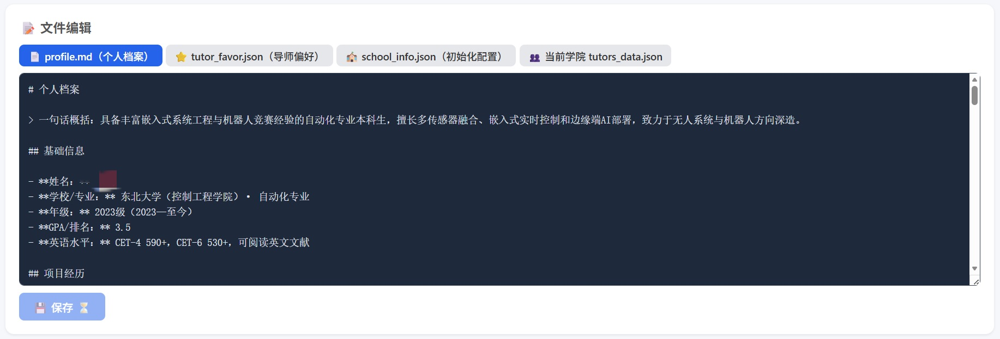
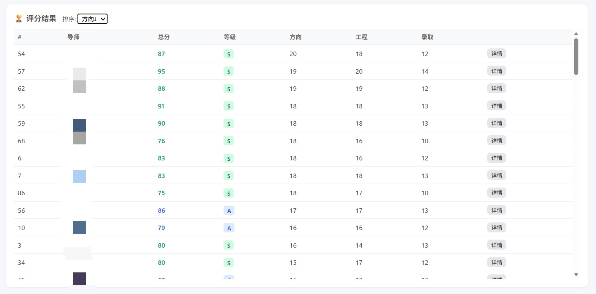
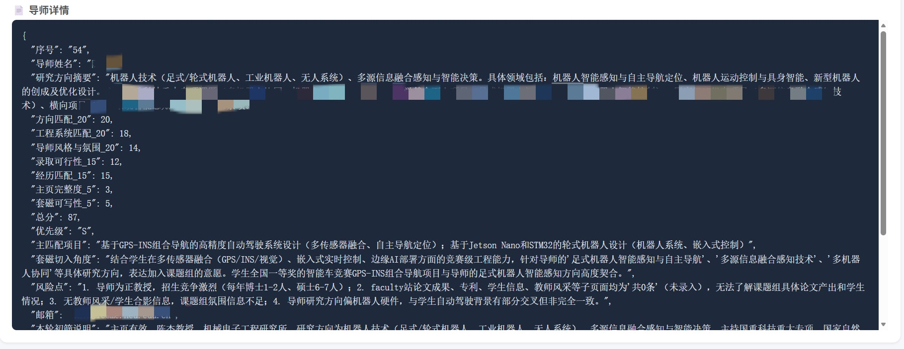
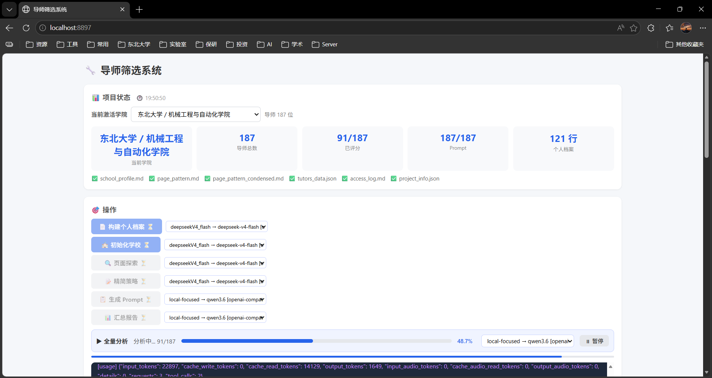

# Byboy_V4

`Byboy_V4` 是一个面向导师筛选与评估的 Python agent 工作台，专门把院校/导师信息搜集里最耗时间的环节自动化：页面分散时，它帮你跨学院页、师资页、导师主页和分页列表持续追踪；信息碎片化时，它把研究方向、联系方式、项目成果、招生线索整理成统一画像；手工整理耗时时，它会直接按你的个人信息定制筛选报告，给出导师评分、优先级排序和可直接使用的套磁建议。它的目标不是替你做最终判断，而是把“找导师、读主页、做分析、生成 prompt、批量评估”这一整套流程标准化，方便你在同一套框架里迭代自己的筛选策略。

### Highlights

- 按个人信息定制导师筛选报告
- 直接给出导师评分、优先级和推荐顺序
- 生成可直接使用的套磁建议与分析 prompt
- 支持 WebUI 一键跑完整流程，减少手工拼接和反复跳页

#### 按个人信息定制导师筛选报告

读取简历、导师偏好和学校信息，自动生成标准化学生 profile。



#### 直接给出导师评分、优先级和推荐顺序

按你的筛选偏好输出导师打分排序结果，帮助快速收敛候选集。



#### 生成定制化的的套磁建议与结构化分析

把学生信息和导师画像拼成可直接使用的匹配建议，方便后续套磁和沟通。



#### 支持 WebUI 一键跑完整流程

通过 WebUI 串起构建 profile、初始化学校、页面探索和全量分析，减少手工拼接和反复跳页。



## 一、用户说明

### 工程用途

工程的目标是把导师筛选流程做成一个可重复、可追踪、可迭代的 Web 工作台。你只需要准备个人信息、导师偏好和学校入口，系统就会自动完成：

- 构建个人档案
- 初始化学院导师名单
- 探索导师主页结构
- 生成导师分析 prompt
- 批量跑全量分析
- 输出结果和评分报告

工程分成四层：

- `framework/`：agent 驱动、模型路由、工具层、上下文管理。
- `workflow/`：导师筛选流程、提示词、用户输入模板、Web UI。
- `workspace/`：学校配置、导师名单、访问策略、分析输出。
- `logs/`：agent 运行日志、上下文缓存、旧流程归档。

### 启动说明

本工程所有开发和测试都在 `Ubuntu 22` 环境下完成。`Windows` 平台做了基本适配，但不能保证所有路径、编码和浏览器依赖都完全兼容。**如果条件允许，优先建议在 Linux 环境部署和使用。**

先准备环境并初始化模板。

首先克隆仓库到本地：

```bash
git clone https://github.com/Ryan-5853/Byboy_V4.git
```

Linux 版：

```bash
cd <repo>
python3 -m venv .venv
source .venv/bin/activate
pip install -r requirements.txt
python3 -m playwright install chromium
cp .env.example .env
python3 init_project.py
```

Windows PowerShell 版：

```powershell
cd <repo>
py -3 -m venv .venv
.venv\Scripts\Activate.ps1
python -m pip install -r requirements.txt
python -m playwright install chromium
Copy-Item .env.example .env
python init_project.py
```

如果 PowerShell 不允许执行脚本，先运行：

```powershell
Set-ExecutionPolicy -Scope CurrentUser RemoteSigned
```

然后启动 WebUI：

```bash
python workflow/webui.py
```

Windows：

```powershell
.venv\Scripts\python.exe workflow\webui.py
```

启动后在浏览器中打开本地地址：

```text
http://localhost:8897
```

如果你在 `.env` 里改了 `WEBUI_PORT`，就把这里的端口换成对应值。

### 可选：本地 SearXNG 搜索服务

`web_search` 默认会优先尝试本地 SearXNG，找不到或请求失败时自动回退到内置 DuckDuckGo HTML 搜索，因此没有安装 SearXNG 的环境也可以正常运行。

推荐用 Docker 安装一个本地 SearXNG：

```bash
docker run -d --name searxng \
  -p 8080:8080 \
  -v searxng-data:/etc/searxng \
  searxng/searxng:latest
```

启动后确认 JSON 搜索可用：

```bash
curl 'http://127.0.0.1:8080/search?q=test&format=json'
```

如果这个接口返回的不是 JSON，请检查 SearXNG 的 `settings.yml`，确保搜索格式包含 `json`，例如 `search.formats` 中启用了 `json`。

如果你使用的端口不是 `8080`，可以在 `workflow/config/workflow.yaml` 里设置：

```yaml
tool_limits:
  search_backend: auto
  searxng_url: http://127.0.0.1:8080
  auto_start_searxng: true
```

`auto_start_searxng: true` 会在本地服务没起来时做一次轻量启动尝试：优先尝试 `systemctl` 的 `searxng` 服务，其次尝试启动 Docker 中名称包含 `searxng` 的容器。启动失败不会中断流程，会直接回退到内置搜索。

### 参数配置

模板初始化和本地实例分离，必须先运行 `init_project.py`。

1. 配置秘钥

把敏感信息放在根目录 `.env` 和 `.env.local`，不要直接写进 YAML。

```dotenv
LOCAL_OPENAI_API_KEY=
DEEPSEEK_API_KEY=
OPENAI_API_KEY=
WEBUI_PORT=8897
```

根据你的 API 平台，自行修改 `.env` 和 `framework/llm_select/models.yaml`，配置模型参数与别名。

2. 填写个人信息和导师偏好

- `workflow/User/resume.*`：放你的简历文件，支持 `pdf`、`docx`、`tex`、`txt`、`md`。建议优先使用纯文本格式，如 `tex`、`txt`、`md`，其他格式可能存在解析失败的情况。
- `workflow/User/tutor_favor.json`：填写你的导师筛选偏好
- `workflow/User/profile.md`：后续由系统自动生成

3. 填写学校初始化信息

- `workspace/school_info.json`：填写学校名、学院名、学院主页或导师名录页

4. 模板更新后，运行一次：

```bash
python3 init_project.py
```

它会把模板同步成本地实例，并尽量保留你已经填过的内容。

### WebUI 使用

打开 WebUI 后，按这个顺序操作最稳：

1. 先确认顶部当前激活学院；如果是第一次运行，还没有学院信息，直接进入下一步即可。
2. 在“文件编辑”里检查 `tutor_favor.json`、`school_info.json` 和简历是否已经就绪。
3. 在“操作”里先点 `构建个人档案`，等待输出构建成功。
4. 再点 `初始化学校`，等待初始化成功。
5. 接着点 `页面探索`，等待完成。
6. 再点 `精简策略`，等待完成。
7. 再点 `生成 Prompt`，等待完成。
8. 最后点 `全量分析`，开始逐个导师分析。这个阶段通常较慢，具体耗时取决于模型速度、导师数量和学校网页结构，可能持续数小时。
9. 全量分析完成后，查看“评分结果”和“汇总报告”。

各按钮的含义：

- `构建个人档案`：读取简历和导师偏好，生成标准化 `profile.md`
- `初始化学校`：读取 `school_info.json`，抓取学院导师名单
- `页面探索`：抽样访问导师主页，提炼页面结构和访问规律
- `精简策略`：把页面访问规律压缩成更短的可执行策略
- `生成 Prompt`：为每位导师生成独立分析 prompt
- `全量分析`：按 prompt 批量分析所有导师
- `汇总报告`：汇总全量输出，生成结果视图

如果中途需要切换学院，直接用顶部下拉框切换即可。切换后，状态、结果、进度和当前导师列表都会同步刷新。

## 二、开发者说明

### 架构

当前工程采用“程序编排，agent 执行”的结构，核心入口在 `workflow/workflow.py` 和 `workflow/webui.py`。

- `workflow/` 负责业务流程编排。
- `framework/agent_router/` 负责把任务配置转成可执行 agent。
- `framework/tools/` 提供文件、网页、浏览器、进程等工具。
- `framework/context_manage/` 负责上下文压缩和长工具结果处理。

更详细的流程说明见 [workflow/README_WORKFLOW.md](workflow/README_WORKFLOW.md)。

### 后端平台

工程当前依赖的主要技术栈是：

- Python 标准库
- `pydantic` 和 `pydantic-ai`
- `Playwright`
- `PyYAML`
- `python-dotenv`

模型配置、上下文管理和工具边界分别由 `framework/llm_select/`、`framework/context_manage/` 和 `framework/tools/` 控制。模型别名与后端映射说明见 [framework/llm_select/README.md](framework/llm_select/README.md)。

### CLI 调试

开发者如果需要调试工作流，可以直接用 CLI。

```bash
python -m workflow status
python -m workflow build-profile
python -m workflow init-school
python -m workflow explore
python -m workflow condense-pattern
python -m workflow gen-prompts
python -m workflow full --parallel 1
python -m workflow report
```

Windows：

```powershell
.venv\Scripts\python.exe -m workflow status
.venv\Scripts\python.exe -m workflow build-profile
.venv\Scripts\python.exe -m workflow init-school
.venv\Scripts\python.exe -m workflow full --parallel 1
```

本地启动 WebUI 也可以作为开发调试入口：

```bash
python workflow/webui.py
```

### 与更早版本对比

下表按版本梳理了工程的演进路径，重点对比架构设计、agent 后端、新特性、主要缺点以及每一版相对前一版的迭代价值。


| 版本 | 架构设计                    | agent 后端      | 新特性                                                                 | 缺点                                                                                                   | 迭代优势                                               | 链接                                         |
| ---- | --------------------------- | --------------- | ---------------------------------------------------------------------- | ------------------------------------------------------------------------------------------------------ | ------------------------------------------------------ | -------------------------------------------- |
| v1   | 手动编排 LLM 任务           | CrewAI          | 支持网页信息搜集、网页清洗和数据分析                                   | 单 agent 能力有限，缺少连续 tool 调用能力                                                              | 作为早期验证版本，证明了导师筛选流程可以被 agent 化    | https://github.com/Ryan-5853/BYboy           |
| v2   | 手动编排 LLM 任务           | 自建 agent 后端 | 进一步尝试自建后端控制层                                               | 仍然缺少连续 tool 调用能力                                                                             | 相比 v1，底层可控性更强                                | https://github.com/Ryan-5853/BYboy_V2        |
| v3   | Prompt 驱动的任务调度工作流 | OpenClaw        | 支持自主探索网页结构、生成高效抓取建议，拥有连续 tool 调用和上下文能力 | 与 OpenClaw 后端耦合较深，流程偏冗余；Prompt 驱动稳定性一般；接口抽象不够清晰，subagent 调用也不够稳定 | 单 agent 能力最强                                      | 未开源，与本地 OpenClaw 耦合                 |
| v4   | 脚本驱动的任务调度工作流    | pydantic-ai     | 支持 WebUI，流程更适合持续迭代和维护                                   | 相比 OpenClaw，单 agent 能力仍在补强中；当前仍存在死锁、上下文溢出等问题                               | 通过脚本编排把流程、配置和 UI 解耦，便于长期维护和扩展 | 本工程 https://github.com/Ryan-5853/Byboy_V4 |

### TODO

- 优化上下文管理
- 优化模型稳定性和兼容性
- 扩展更多 tool，使 agent 获得更高效的网页查找能力
- 加入视觉模型分析
- 加入舆论网站分析

## 三、版权与免责

### 版权声明（重要）

本工程中的主要代码由作者独立编写，发布目的仅用于学习、交流与讨论。

严禁任何形式的商业化使用，包括但不限于：售卖、二次打包收费、商业 SaaS 集成、商业咨询交付等。

若你基于本项目进行学习或改进，欢迎在非商业场景下参与贡献与讨论。

本项目将持续更新，欢迎 issue / PR / 交流建议。

### 使用限制与合规声明（重要）

使用本工程即表示你承诺遵守以下约束：

- 平台与服务条款

  - 遵守 LLM 与第三方服务条款。
  - 必须遵循各模型厂商、网关服务、抓取服务的地区限制、账号政策、API 使用协议与服务条款。
- 法律与用途边界

  - 禁止违法违规用途。
  - 不得使用本工程生成、传播、协助生成违法违规信息，不得从事任何违反法律法规的活动。
- 公开信息原则

  - 仅用于公开信息收集。
  - 仅可处理公开可访问的信息页面；不得用于抓取、归档或推断个人隐私、敏感身份信息等。
- 内容真实性

  - 禁止生成不实内容。
  - 不得利用本工程伪造、篡改或批量生成虚假导师/院校信息，不得用于误导性传播。
- 网站规则与反爬策略

  - 遵守网站规则与反爬策略。
  - 对存在明确反爬机制、访问限制、robots 协议限制或明确禁止自动化访问的网站，不得进行自动化抓取。
  - 不得绕过验证码、鉴权、频控、风控或其他技术保护措施。
- 访问频率与影响范围

  - 控制访问频率与影响范围。
  - 应合理限速，避免对目标站点造成异常负载、服务干扰或安全风险。
- 数据安全与结果复核

  - 数据安全与最小化原则。
  - 对产生的中间文件与结果文件应妥善保存，避免泄露；仅保留必要数据，尽量减少冗余复制。
  - 结果需人工复核。
  - LLM 输出可能存在幻觉或抽取偏差，任何用于决策、公开传播或提交材料的内容必须人工核验。

如因不当使用导致的法律风险、账号风险或第三方纠纷，由使用者自行承担责任。

### 贡献与后续计划

欢迎提交 issue：

- 错误反馈
- 配置疑问
- 适配建议

欢迎提交 PR：

- bugfix
- 新 agent
- 提示词优化
- 文档改进

使用本工程即表示你已知晓并接受上述约定。
